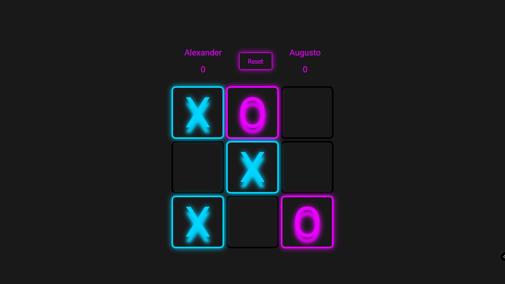
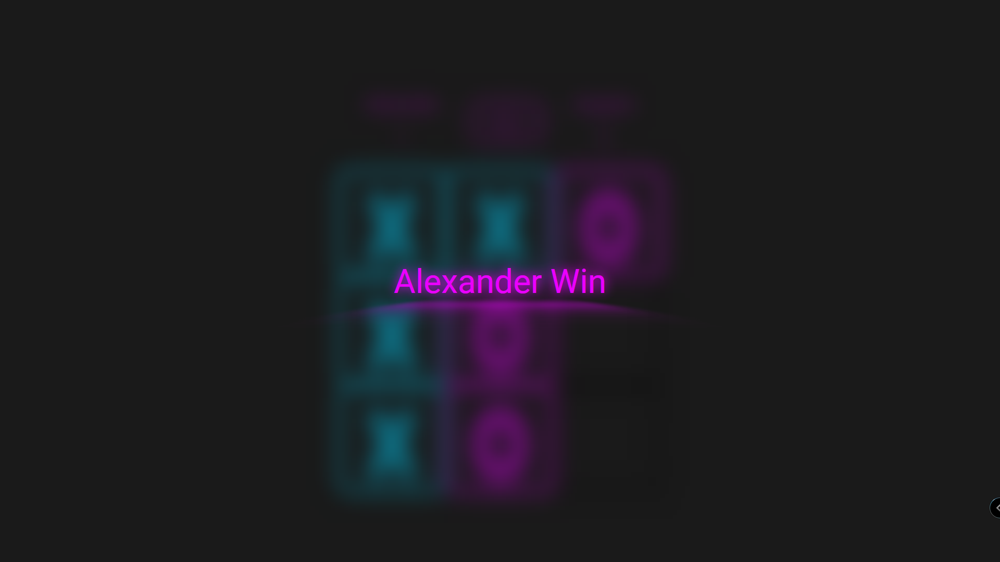

# Tic-Tac-Toe

Game made in html/css and js, with the use of factory functions and IIFE to create modules, that way i can separate the logic code and the visual.

- You can enter the name for the two players.
- Can see the result of the match.
- It has a counter for games won.
- A button for reset the game.

